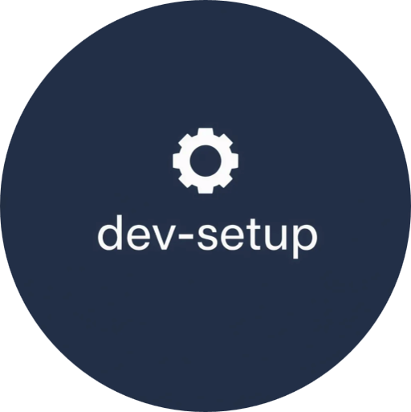

# Development Setup

<div markdown="span" align="center">

<figure>
    
</figure>

[](https://github.com/fedejaure/dev-setup/releases)
[](https://github.com/fedejaure/dev-setup/actions?workflow=tests)
[](https://fedejaure.github.io/dev-setup/)
[](https://opensource.org/licenses/MIT)

[](https://github.com/pre-commit/pre-commit)
[](https://www.contributor-covenant.org/version/2/0/code_of_conduct/)

</div>

My own Ansible collection for development setup (use by your own risk).

* GitHub repo: <https://github.com/fedejaure/dev-setup.git>
* Documentation: <https://fedejaure.github.io/dev-setup/>
* Free software: MIT

## Features

### Mac OS

- [x] Applications installed with Mac App Store.
- [x] Applications installed with Homebrew Cask.
- [x] Tools/Package installed with Homebrew.
- [x] Tools installed with pipx.

### Linux

- [ ] Comming soon ...

## Quickstart

### Starting from a brand-new machine.

1. Download this repository to your local drive.

3. Install requirements:

    Create a temporary virtualenv, activate the virtualenv and install ansible:

    <!-- termynal -->

    ```console
    $ /usr/bin/python3 -m venv .venv
    $ . .venv/bin/activate
    (.venv)$ pip3 install ansible
    ---> 100%
    Installed
    ```

4. Install ansible requirements `ansible-galaxy install -r requirements.yml`.

5. Copy `inventory.example` into `inventory` and set the desired `<target-os>` (`macos`):

    ```ini
    [<target-os>]
    127.0.0.1 ansible_connection=local ansible_python_interpreter=/usr/bin/python3
    ```

    to e.g.:

    ```ini
    [macos]
    127.0.0.1 ansible_connection=local ansible_python_interpreter=/usr/bin/python3
    ```

6. Run `ansible-playbook playbooks/main.yml --ask-become-pass -i inventory`.

For a more detailed usage guide by OS, including remote machine setup and configuration options,
please refer to the [Usage Section](http://fedejaure.github.io/dev-setup/usage/) in the official documentation.

## Author Information

This playbook was created in 2020 by [Federico Jaureguialzo][fedejaure].

[fedejaure]: https://github.com/fedejaure
